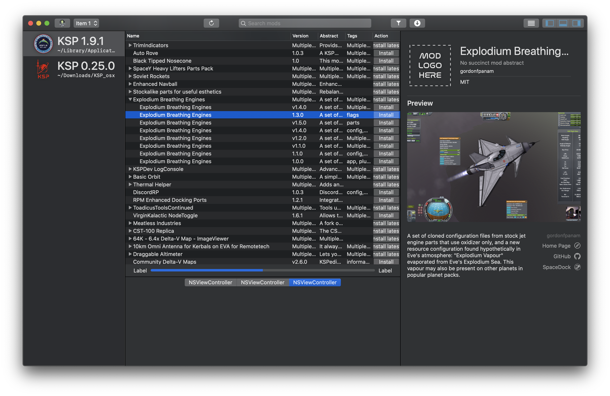

	

<h1 align="center">
	not entirely unlike CKAN
</h1>

	Or, neuCKAN, pronounced as <code>| n(j)u(ː)(siː)kæn, n(j)u(ː)(siː)kan, nɔʏ̯t͡seːkan, nœ(se)kɑ̃ |</code> or however you like, a mod manager for Kerbal Space Program that's not entirely unlike CKAN.

| branch      | status                                                       |
| ----------- | ------------------------------------------------------------ |
| master      |  |
| development |  |

---

### Table of Contents

- [Why?](#why)
- [What is neuCKAN exactly?](#what-is-neuckan-exactly)
- [Some features, as planed so far](#some-features-as-planed-so-far)
	- [Tentative alpha roadmap](#tentative-alpha-roadmap)
	- [Unscheduled features](#other-features-unassigned-to-or-depending-on-future-alpha-releases)
- [Help, please...](#help-please)

---

## Why?

In addition to [CKAN's GUI not being supported on macOS Catalina](https://github.com/KSP-CKAN/CKAN/issues/2906), when it was working previously, it had always been glitchy, and inconsistent with the system's and native macOS applications' behaviours. In general, macOS never felt like a priority in CKAN's development. Instead, it felt more like a freebie from .NET's cross-platform support. The fault, however, does not lie in the CKAN community, but in that [there just aren't many people use and play games on macOS compared to other systems](https://store.steampowered.com/hwsurvey). And quite the contrary, [some people tried to revive CKAN GUI on macOS](https://github.com/KSP-CKAN/CKAN/issues/2848), but the efforts have all been abandoned. [CKAN's Console UI still works on macOS Catalina](https://github.com/KSP-CKAN/CKAN/pull/2911), and likely on future macOS versions as well, but why settle for less when there is a possibility for more? So, here comes neuCKAN to fill the gap.

## What is neuCKAN exactly?

neuCKAN is a mod manager for Kerbal Space Program. It shares some similarities in functionalities with [CKAN](https://github.com/KSP-CKAN/CKAN), and it uses [CKAN metadata](https://github.com/KSP-CKAN/CKAN-meta), but it's not a skin of CKAN. neuCKAN is written from scratch in Swift, and designed with macOS in mind. It strives to be scalable, safe, efficient, responsive, and modern overall. It has both a GUI and a CLI as well, like CKAN does.

This is what the GUI looks like in [neuCKAN 0.0.2][neuCKAN 0.0.2]:

As you can see from the screenshot, the mod manager is very much incomplete. In future releases, the blank space on the bottom will show statistics, such as system resource usage and distribution of mods installed by their keywords. Functionally, as of now, it can only install mods that are not hosted on [spacedock](https://spacedock.info). If you would like to help make neuCKAN better, propel it forward, please check out the [contribution guide](CONTRIBUTING.md)

Although this project started as a KSP mod manager on macOS, it will not end in just being a KSP mod manger on macOS. With Swift already on Linux, Swift 5.3 officialy coming to Windows in 6 months, and [WinUI support under way](https://forums.swift.org/t/documenting-winui-support-progress/35592), there is no reason not to expand the project's scope to building for Linux and Windows in the future.

## Some features, as planed so far

### Tentative alpha roadmap

| status                    | version | features                                                  |
| ------------------------- | ------- | --------------------------------------------------------- |
| [Released][neuCKAN 0.0.1] | 0.0.1   | The bare-minimum proof of concept.                        |
| [Released][neuCKAN 0.0.2] | 0.0.2   | The details view on the right side.                       |
| In progress               | 0.0.3   | Sorting by some columns, and row actions.                 |
| Planned                   | 0.0.4   | Persistant data storage through Core Data integration.    |
| Planned                   | 0.0.5   | Mod dependencies/conflicts/suggestions/recommendations... |
| Planned                   | 0.0.6   | CLI                                                       |
| Planned                   | 0.0.7   | Undo/redo actions through Core Data integration.          |
| Planned                   | 0.0.8   | Search and filter through Core Spotlight integration.     |
| Planned                   | 0.0.9   | Preferences.                                              |

### Other features unassigned to or depending on future alpha releases

- Full localization, with automatic text directionality handled by cocoa natively.
- Full help manual.
- Automatically detect all KSP installations on disk, and their installed mods.
- Automatic crash report, and integrated bug report.
- Preview 3D models in neuCKAN, for mods that contain parts.
- When the user uses the serach field, neuCKAN provides options for limiting the search's scope.
- The dock icon displays installation progress, CPU usage, network usage, or active KSP target.
- A developer mode that allows modders to submit CKAN metadata for new mod releases through neuCKAN.
- Compatibility with CKAN save files.
- KSP 2 support, although there is little information on how it handles mods, and virtually none on its macOS support.

There is a lot more of features that I have planned for neuCKAN, but they all sound too crazy to be listed here at this moment. 

## Help, please...

Here are some areas in the project with which I absolutely need help from more talented people. They are grouped by their urgency.

### Urgent

- Dependency graph for mods. (PRIORITY for 0.0.5)
- spacedock URLs aren't very friendly.
	- Some spacedock URLs can not be parsed from CKAN metadata files into Swift's `URL` type, although the links themselves are correct.
	- Mods hosted on spacedock can not be downloaded using [Alamofire](https://github.com/Alamofire/Alamofire), although the links themselves are correct.
- CKAN metadata parsing fails when files are parsed concurrently.
- Unit tests and all sorts of tests.

### Not so urgent

- Pesky Auto Layout constraint warnings.
- Calculate and improve time and memory complexities on methods, initialisers, subscripts, basicaly all sorts of closures.

### Not urgent at all

- A new, much polished, not-hand-drawn app icon.
	- Please open an issue if you want to help with the app icon.
	- Please use the current app icon as the basis for the new icon. The source files for the current app icon can be found [here in the repository](UI/Icons/App/).
	- Please follow [Apple's app icon design guide](https://developer.apple.com/design/human-interface-guidelines/macos/icons-and-images/app-icon/).
- Custom UI elements appear blurry in neuCKAN. Their source files can be found [here in the repository](UI/Icons/).

## Release Process

The alpha phase will have a fast iterative development process. There will be nightly snapshots, as well as proper, versioned alpha releases. Because the program is still far from stable, there will be no installers provided in the alpha phase.

---

	
	
		
	

	

[neuCKAN 0.0.1]: https://github.com/WowbaggersLiquidLunch/neuCKAN/releases/tag/0.0.1
[neuCKAN 0.0.2]: https://github.com/WowbaggersLiquidLunch/neuCKAN/releases/tag/0.0.2
